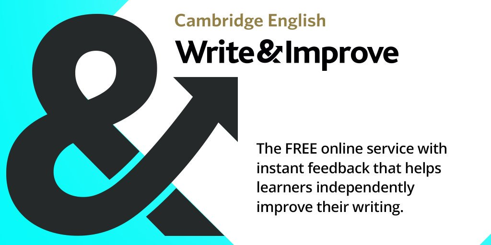
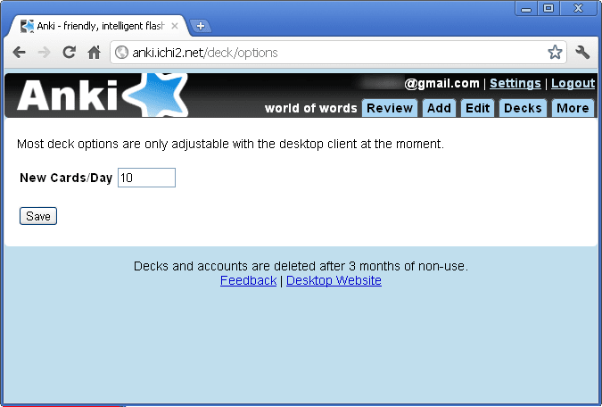

Gostaria de apresentar a quem não conhece, duas ferramentas bem interessantes que venho utilizando nos meus estudos de inglês.

A primeira delas é exclusiva para esse fim e serve para a prática da escrita. Seu texto é avaliado por uma inteligência artificial que analisa, corrige e dá dicas para melhorar sua redação. É o “Cambridge English Write&Improve”. Ele é gratuito para alunos e muito simples de usar.

{: .align-center}

A segunda ferramenta é ainda mais simples e abrangente. Trata-se do “Anki”. Ele é um software de código livre que organiza estudos e metas em formas de “cartões”. Semelhantes àqueles cartões físicos que usávamos com uma charada na frente com a resposta atrás lembram? Pois bem, a ideia dele é ser uma versão virtual dessa brincadeira, controlando inclusive quantos deles você quer estudar por dia e registrando resultados.

{: .align-center}

Você pode criar os seus próprios cartões ou, melhor ainda, pode baixar gratuitamente cartões (coleções deles na verdade) já prontos e compartilhados por outros estudantes. Há cartões de diversas matérias e alguns bem interessantes para o estudo do inglês, até mesmo contendo o áudio.

Ambos acabam sendo uma excelente fonte de exercícios, que são a grande lacuna ao se estudar por conta própria e não dispor de materiais didáticos de escolas.

Não deixem de conferir e espero que gostem tanto quanto eu. Lembrando que estou à procura de parceiros para treinar conversação em Inglês pelo Skype, então, se tiver interesse é só me contactar.

Abraço à todos