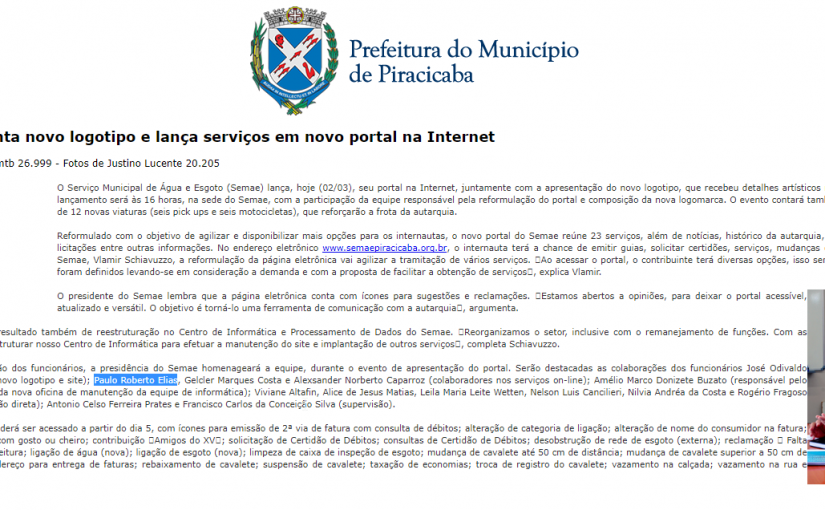
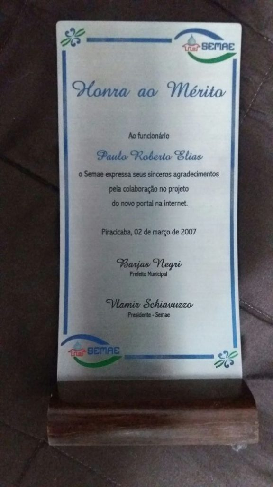

Estava hoje revisando meu currículo e decidi incluir uma experiência antiga que vinha deixando de fora, que foi quando trabalhei por mais de 6 anos como servidor público municipal em Piracicaba. A princípio, eu sempre ignorava essa experiência, pelo fato da mesma não ser no ramo que estou atualmente e por uma possível falta de relevância.

Contudo, mudei de ideia ao lembrar de um projeto muito legal que participei na época. O desenvolvimento da primeira versão do Website da empresa. O fato foi inclusive citado (assim como meu nome), no site oficial da cidade, conforme vocês podem verificar abaixo:

{: .align-center}

A citação encontra-se disponível até hoje nesse [link](http://www.piracicaba.sp.gov.br/imprimir/semae+apresenta+novo+logotipo+e+lanca+servicos+em+novo+portal+na+internet.aspx).

Recebi também uma “placa de honra ao mérito” que guardo até hoje:

{: .align-center}

Foi legal relembrar esse projeto, o quanto aprendi com ele e o quanto tudo que eu sempre fiz foi relacionado à tecnologia, mesmo quando não fazia parte das minhas atribuições. Lembro também que desenvolvi um gerenciador de documentações que agilizou muito o atendimento e foi utilizado por muitos anos (se é que ainda não utilizam).

A verdade é que todas nossas experiências nos moldam para o que somos hoje, mas optamos por omitir algumas delas pela falta de espaço disponível em um curriculum vitae ou mesmo para evitar quaisquer informações desencontradas ou falhas de entendimento, mas com certeza, recrutadores atentos acabam por entender todo esse contexto e valorizar todas as histórias que você tiver para contar.

Abraços
