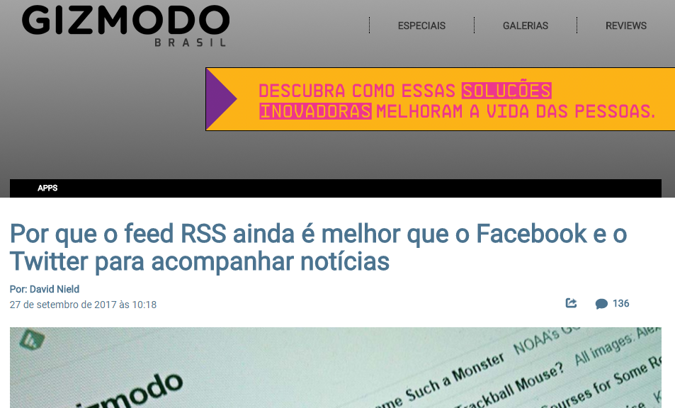

É…demorei…claro que não dá pra comparar o meu blog com sites de notícias ou produção de grandes conteúdos. Inclusive o escopo dele é outro. Uso o blog para exercitar minha escrita e aumentar minha presença online apenas, na vã esperança que alguém se interesse.

Por isso também nunca publico notícias aqui, jamais teria capacidade de ser mais rápido ou ter informações mais privilegiadas que “insiders“, ou principalmente rivalizar com minhas principais fontes de informação.

É justamente sobre elas que queria falar neste post e sobre como consumo a maior parte das informações que recebo, e eis que me deparo hoje, com esse post, de uma das minhas fontes preferidas: o [Gizmodo](http://gizmodo.uol.com.br/).

{: .align-center}

> Eu recomendo que você leia o texto acima antes de continuar, mas por favor, volte 🙂

Eu sou um usuário assíduo de conteúdos em RSS. Fiquei apavorado quando o Google anunciou o fim do Google Reader mas, por sorte, o [Feedly](http://cloud.feedly.com/) veio para nos salvar e continuo podendo consumir meus conteúdos da forma que mais gosto, escolhendo as fontes “a dedo”, vendo apenas na hora que desejo, sem notificações, compartilhando apenas o que quero, entre outras vantagens. Tanto no navegador do PC quanto no App do meu smartphone.

Aliado então à outro serviço que adoro, que é o [Pocket](http://getpocket.com/), a coisa realmente fica séria. Ele é um ótimo “guardador de links para mais tarde” e possui integração diretamente com seu navegador (browser), através da instalação de plugins ou mesmo com o próprio Feedly, onde consigo guardar diretamente no Pocket, que por sua vez, me permite controlar o que já li ou não, compartilhar, essas coisas…

Há mais a se falar, de ambos serviços, como por exemplo, competidores que entregam funções semelhantes, problemas, vantagens (o Pocket faz download no App e você ainda pode ler desconectado depois…), mas a verdade é que o Gizmodo hoje foi minha inspiração final e ao mesmo tempo um fator de desânimo. Não me sobraram mais que migalhas de informação pra te dar.

Só não posso deixar de aproveitar para lhe dizer para seguir este blog que você está lendo. Sim, por usar tecnologia WordPress, ele vem com um RSS embutido, sendo assim, basta você adicionar o endereço abaixo no seu leitor:

https://prelias.github.io/paulorobertoelias.com.br/feed.xml

Muito obrigado e até a próxima.