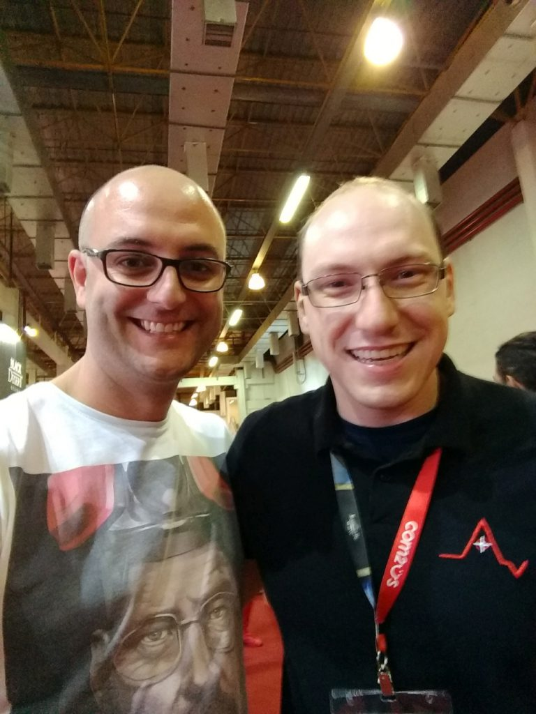
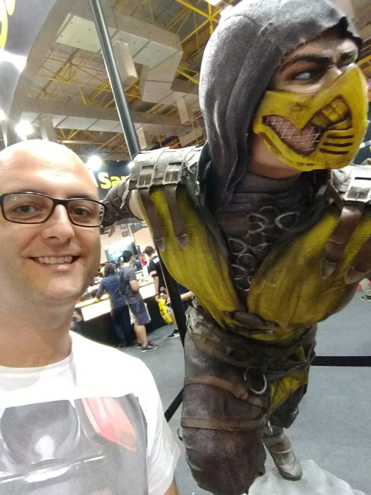
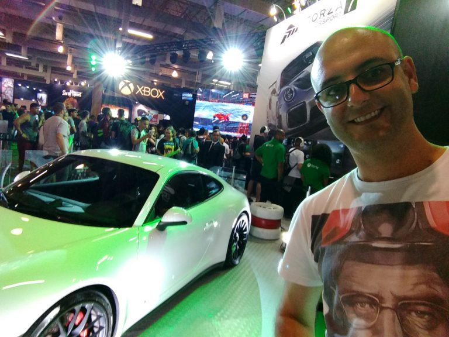
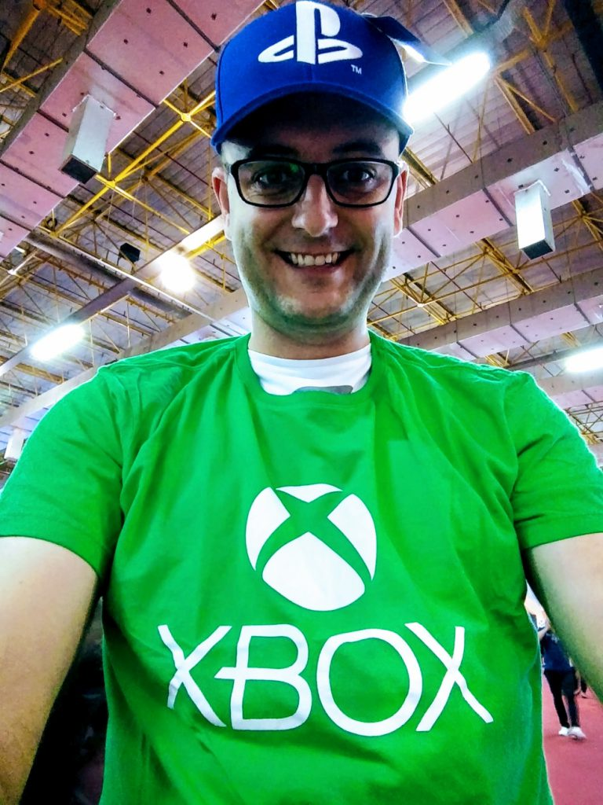

Ontem estive mais uma vez em São Paulo para a Brasil Game Show 2017. O evento está a cada ano mais belo e organizado e valeu muito todo o esforço e custo para comparecer.

Acabei precisando ir sozinho pois, bem na hora, meu amigo Marcos Alves foi convocado para o trabalho e o ingresso não podia mais ser transferido (talvez se eu tentasse entrar em contato pelo telefone, mas sequer tinha algum convidado em vista).

Estava tudo muito cheio, mas as filas, que esse anos foram “virtuais” em alguns stands, deram um visual muito mais organizado. Faltaram também reais novidades, mas não é culpa dos organizadores. Anos com lançamentos de novos consoles sempre são mais interessantes e nem Xbox One X nem PS4 Pro (que já foi lançado), são necessariamente novos videogames.

Vi poucas celebridades também, ou pelo menos não as reconheci, já que muitos Youtubers marcaram presença, mas não os acompanho e por isso não os conheço.

{: .align-center}

Pelo menos pude tirar uma foto com o [Diego Kerber](https://adrenaline.uol.com.br/staff/diego-kerber) da Adrenaline. que é muito gente boa por sinal.

Consegui porém, tirar muitas fotos legais, como essas abaixo:

{: .align-center}

{: .align-center}

Não podia faltar também, claro, minhas comprinhas, mas, devido a crise 🙂 só fiz investimentos de baixo valor hahahaha.

{: .align-center}

E sempre sem escolher um lado! Por que não jogar tudo que pudermos? Comprei também uma camisa preta Playstation e o jogo The Last Guardian que saiu por apenas 29 reais por ter gasto mais de 100 na loja da Sony.

Só senti falta mesmo foi de um stand da Nintendo…sempre ela aprontando dessas com os brasileiros…quem sabe ano que vem.

Caso queira curtir todas minhas fotos e vídeos, basta acessar o link abaixo:

[Google Photos Album](https://photos.app.goo.gl/3UHMpb9k2OXXRXzz2)

Obrigado e até a próxima.
