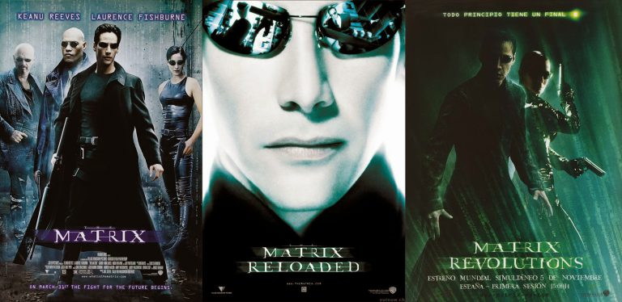

Há tempos eu queria escrever sobre esse filme que eu tanto amo, mas não costumo escrever muito sobre filmes, principalmente tanto tempo depois do lançamento. Acho que na maioria dos casos, não se sobra muito pra falar. Ou você se apressa em tentar expressar uma opinião enquanto ele é notícia ou fica com as sobras quando todo mundo já viu e não quer mais saber…

{: .align-center}

Por outro lado, há filmes que realmente nos marcam e esses são os meus preferidos. Filmes que realmente nos fazem divagar sobre a vida e o futuro. E esses filmes custam a sumir das nossas mentes e parecem nos fazer brotar sentimentos diferentes a cada vez que o assistimos.

Obviamente que várias obras diferentes tocam corações ainda mais diversos e o que é sublime pra mim pode passar completamente despercebido pra outra pessoa. Além disso, nossa opinião muda muito nas diversas fases da nossa vida, ou mesmo de acordo com o nosso espírito ou pré-disposição à uma obra, ainda mais em tempos de internet e de enxurradas de opiniões que nos fazem duvidar das nossas próprias convicções.

Como você pôde perceber por essa tediosa introdução, esse não é um post curto e grosso sobre o filme também, mas sim, um “textão” sobre minha relação com essa obra e o que me faz gostar tanto dela e até mesmo sobre meu antigo filme preferido antes deste.

Quem me conhece sabe que sou simplesmente apaixonado por Matrix. Talvez pela idade com que assisti o filme no lançamento, talvez por ser igualmente apaixonado por tecnologia, ou por ele ter tanto a ver com games, talvez por tudo isso, mas simplesmente por quanto ele foi disruptivo e carregava o que pra mim torna uma ficção científica brilhante: a sua capacidade de ser “incontestável”. Sua história jamais poderá ser completamente negada ou provada e até cientistas sérios falam sobre vida em simulação.

{: .align-center}

A sua “apresentação em camadas” é simplesmente espetacular, agradando quem gosta de ação, de romance e propiciando diversos níveis de entendimento. Para mim ele foi o primeiro contato com “universos” criados sobre uma obra, com expansões da história e comunidades em torno. Hoje também bem sei que muitas dessas coisas (pra não dizer quase tudo), do culto, do enredo, do mistério em torno do universo, não foram tão originais assim (estou lendo [Neuromancer](https://pt.wikipedia.org/wiki/Neuromancer)), mas nada disso tira o seu brilho nem o seu mérito por ter sido um divisor de águas.

Partindo de Matrix, eu simplesmente comecei a consumir todas as obras vindas do irmãos (hoje irmãs) [Wachowski](https://pt.wikipedia.org/wiki/Lilly_e_Lana_Wachowski). E embora “V de Vingança” seja simplesmente sensacional, suas obras foram decaindo de qualidade absurdamente, ao ponto de eu simplesmente odiar qualquer coisa que eles façam hoje em dia. Sense8 é pavoroso, me desculpem.

{: .align-center}

> Eu simplesmente amo esse GIF e estou feliz de finalmente poder usá-lo.

🙂

Interestellar não tem esse poder todo ou a importância histórica pro cinema e pra ficção científica que Matrix tem, nem mesmo quaisquer semelhanças, ou sequer se apoia nas mesmas bases e estratégias (não há combate ou lutas nessa viagem espacial), mas compartilha o fato de ser uma ficção de grande apelo emocional e te fazer sentir pequeno. Ele é realmente emocionante e sim, eu choro pra cacete com ele!

## O filme

Bom, vou tentar não dar spoiler nenhum, até por que, minha intenção é, quem sabe, convencer alguém ou mesmo lembrar alguém de assistir, caso já não o tenha feito. Embora isso tire bastante da graça e me limite bastante no que dizer, infelizmente.

Na história, o planeta Terra está morrendo e a humanidade procura uma solução, que passa por procurar um novo planeta para habitarmos e esse pano de fundo carrega uma história profunda, sobre uma das formas de amor mais bonitas que existem, o de um pai por sua filha e vice-versa.

Como se não bastasse lidar com essa forma tão sublime e especial de amor, ele se dispõe a sugerir em uma das falas que talvez o amor tenha um objetivo no universo…não se preocupe, você não vai identificar essa cena por ter lido isto, antes de vê-la.

Com um final muito controverso e até mesmo psicodélico, dividiu muitas opiniões e recebeu muitas críticas negativas por isso e foi então que me deparei com o vídeo abaixo e que me inspirou a escrever esse post.



Na entrevista concedida pelo popstar da física mundial, Neil deGrasse Tyson, fica fácil perceber como você pode sim respeitar o que foi feito, em vez de ficar se achando entendido do assunto e curtir uma obra que tenta imaginar o que nenhum ser humano sequer chegou perto de vislumbrar e quiça você passe a admirar o esforço desses artistas em tentar colocar em imagens o que faz parte apenas da imaginação, mesmo de grandes cientistas.

O filme tem um ar de esmero poucas vezes vista no cinema, não se deixando levar por artifícios comuns em nome do sucesso. É fácil imaginar um investidor pedindo ação ou lutas…de certo isso ocorreu…hehehe. A parte musical é igualmente fenomenal e eu escuto as músicas da trilha sonora até hoje.

É…

Talvez mais uma vez o meu texto não tenha conseguido realizar o que propus no início. Se resumindo como sempre, a servir como um diário, um baú de memórias para mim mesmo. Que me permita, assim como citei (agora assim fechei o arco :)) voltar aqui no futuro e tentar decifrar como eu me sentia sobre esse filme e como um olhar de outro tempo pode mudar tudo.

Dica: tempo tem tudo a ver com o roteiro também…não é perfeito esse filme?

Abraço
