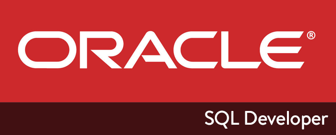

Olá a todos. Hoje vou falar de um recurso muito útil deste cliente de banco de dados. Embora a aplicação possa ser utilizada com diversos SGBD, devido ao suporte a ODBC, o recurso que vou apresentar hoje só funciona em bancos de dados Oracle (pelo menos até a última vez que eu testei).

É muito comum para analistas e administradores de sistemas em geral, a necessidade de consultar diretamente a base de dados a todo momento e muitas vezes, poder salvar seus scripts já basta. Contudo, a possibilidade de encadear muitas consultas de uma só vez, em modo “mestre x detalhes”, de modo fácil e dinâmico, é muito bem vinda.

Acredito que todo mundo que tenha chego até aqui na leitura, já saiba do que se trata, em todo caso, em vez de explicar o conceito, vou apresentar-lhes o passo-a-passo e com certeza vocês enxergarão as vantagens e aplicabilidade dessa ferramenta.

Com o aplicativo aberto, clique com o botão direito do mouse no item “Relatórios Definidos pelo Usuário”, conforme print abaixo:

{: .align-center}

> Caso esta janela não esteja aparecendo, basta selecioná-la no menu Exibir > Relatórios

Será apresentada uma janela / formulário para preenchimento. Os campos até aqui são auto-explicativos, só vale lembrar que você deve escrever sua consulta “original” ou mestre, no campo SQL.

Preencha conforme desejado e salve. Logo após, o relatório deve aparecer na pasta exibida no print acima. Selecione agora o próprio relatório com o botão direito do mouse e acione a opção editar.

Será apresentada novamente a janela de edição, desta vez, contendo a opção de Relatório Filho. Clique em adicionar filho e escolha um nome para o mesmo.

{: .align-center}

A mágica ocorre no relatório filho, pois ele pode se valer de variáveis provenientes da consulta meste, conforme o print abaixo:

{: .align-center}

Repare que eu usei na cláusula where uma variável Oracle. Ela deve ter o mesmo nome de qualquer coluna do resultado da consulta mestre. Caso a sua query mestre possua prefixos, como por exemplo tb_users.userid, lembre-se de utilizar um alias para a coluna e usar o mesmo alias como o nome da variável.

E é só isso. Assim que você clicar no relatório, a query mestra será executada automaticamente e ao clicar sobre quaisquer linhas do resultado, o relatório filho será executado baseado na sua seleção.

{: .align-center}

> Na imagem acima vemos a execução de um relatório com um relatório filho. As informações sensíveis foram apagadas

É possível criar quantos relatórios filhos você desejar e para abrir mais de um relatório de uma vez, será necessário selecionar para executar em outra aba.

Também podemos salvar o relatório como um arquivo XML e com isso compartilhá-los ou mesmo fazermos backups.

Espero que gostem e considerem essa dica e principalmente esta funcionalidade, tão útil quanto eu.

Até a próxima.

