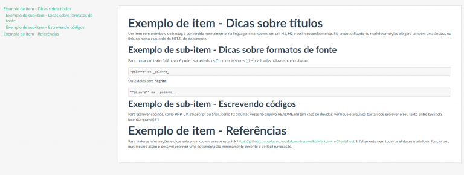

Há tempos tenho várias ideias para melhor controle de documentações em projetos, já que atuo diretamente criando e mantendo arquivos desse tipo há anos trabalhando como analista.

Obviamente que os contextos são muitos e por diversas vezes encontramo-nos em processos já bem maduros, nos quais temos pouca liberdade de propormos inovações.

Mas uma coisa que sempre foi um mantra pra mim é: trate a documentação com o mesmo carinho que o código, afinal, são tudo “apenas texto”.

Hoje em dia, com os repositórios de arquivos em nuvem, o cenário do controle e compartilhamento de arquivos vem mudando muito, mas ainda carece de algumas funcionalidades que os desenvolvedores possuem às mãos em seus repositórios de código, seja ele git, svn, ou qualquer outro. Como por exemplo, o controle de alterações com observações e a centralização.

Porém, não é nenhum pouco recomendável guardar arquivos binários nesses repositórios (além de ser “impossível” rastrear mudanças), bem como não é interessante escrevermos documentação em texto puro, tampouco HTML, que acaba não sendo tão prático e demanda ao menos um conhecimento básico.

Nesse contexto, a linguagem markdown cresce como uma forte candidata. É inclusive a linguagem utilizada nas documentações dos repositórios no GitHub. Porém, os navegadores (ainda talvez) não leem arquivos “.md” e exibem como HTMLs. E é aí que entra a ideia da transformação de arquivos markdown em HTML.

Já há muitos projetos prontos, com as mais diversas tecnologias que se propõem a esse tipo de trabalho e eu escolhi um deles para me basear e fazer uma versão ainda mais enxuta, ao menos na intenção de difundir a ideia e lembrando que, sempre é possível utilizar-se do projeto original e a plenitude de suas funcionalidades.

Exemplo de arquivo gerado pelo projeto:

{: .align-center}

O layout fornecido pelo [projeto original](https://github.com/mixu/markdown-styles) apresenta sim alguns problemas e há muito espaço para evolução (eu sequer cheguei a testar mais deles), mas o template escolhido gera uma página como a da imagem acima, sendo possível navegar nos tópicos pelo menu à esquerda.

Com os arquivos gerados, é possível também publicá-los num website, inclusive até mesmo dentro do próprio sistema para o qual foi destinado, sendo ainda mais prático que um compartilhamento tradicional de arquivos e suas várias versões nos e-mails de cada um…

Para baixar e utilizar o projeto, acesse o repositório do mesmo no meu GitHub:

[document-generator](https://github.com/PRElias/document-generator)

Lá você encontrará mais orientações e garanto que será bem fácil começar. Caso se interesse e tenha dúvidas, ou mesmo sugestões, basta entrar em contato.

Abraço à todos.