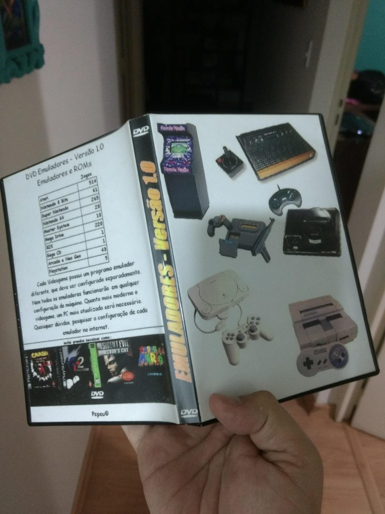

O cenário da emulação mudou bastante nos últimos anos, com o surgimento das versões para os mini computadores Raspberry Pi, que viraram simplesmente uma febre.

Eu já brinco com emuladores há muitos anos. Era tão apaixonado que já tentava iniciativas que promovessem eles desde jovem. Cheguei certa vez a compilar um DVD, usando um software que montava uma espécie de instalador, copiando os arquivos e criando atalhos no menu Iniciar do Windows e na área de trabalho. Cheguei a fazer até uma capa.

Pela data dos arquivos que estão no disco, isso foi em abril de 2006. Que saudades…

> Caso você queira pular toda essa minha história e explicação sobre os emuladores, pode ir direto para o site do projeto, clicando [aqui](https://prelias.github.io/win10_emulation_station/){:target="_blank"}. Lá contém uma explicação de como proceder para instalar.

Voltando a falar do cenário atual e do [Raspberry](https://pt.wikipedia.org/wiki/Raspberry_Pi){:target="_blank"} (eu mesmo tenho o meu, lógico), trata-se de um minicomputador, com poder suficiente pra emular os consoles antigos.  Para um apaixonado pela nostalgia dos games do passado, é simplesmente maravilhoso. Eles viraram uma febre, embora nem todo mundo conheça por esse nome, pois muitas pessoas comercializam um pacote já pronto contendo o computador, jogos, etiquetas e até cabines ou controles.

Porém, muita gente ainda usa o próprio PC para emulação de jogos e é possível aproveitar alguns dos desenvolvimentos que fizeram para ele, também no Windows, ficando com um sistema praticamente idêntico ao conseguido no mini PC.

Uma das principais evoluções foi o advento do [Libretro](https://www.libretro.com/){:target="_blank"} e do [Retroarch](http://www.retroarch.com/){:target="_blank"}. Trata-se de aplicações ou projetos, que converteram os antigos emuladores em DLLs, fazendo eles trabalharem por debaixo dos panos, através de uma interface única, o que permitiu que você trocasse de console sem sequer sair do aplicativo.

Em cima desses sistemas, surgiram mais diversos projetos de customização da interface e um deles, que é muito famoso e funciona no Windows, é o [Emulation Station](https://emulationstation.org/){:target="_blank"}.

## O projeto

Procurando na internet, encontrei um projeto no GitHub que fazia quase exatamente o que eu esperava. Ele conecta nos endereços corretos, baixa e configura tudo automaticamente, de forma bem fácil.

Realizei um fork do repositório e inclusive inclui minhas próprias contribuições (conto um pouco mais sobre esse processo em um futuro post). Sendo assim, você pode usar os links desse post para a minha versão do projeto ou acessar o original [aqui](https://github.com/Francommit/win10_emulation_station){:target="_blank"}.

Eu inclui os dois links para que, caso alguma modificação minha não seja aceita pelo dono do projeto original, seja possível ter as duas opções, e também, claro, para dar o devido crédito.

O arquivo de instruções está em inglês, mas possui um link para a tradução em português que eu escrevi.

## Instalando

Você pode navegar até o site e baixar o pacote do Emulation Station por si mesmo, mas algumas configurações são um pouco mais complexas de serem feitas e é aí que entra o projeto “win10_emulation_station”.  Se preferir, você pode baixá-lo nesse link: [download](https://github.com/PRElias/win10_emulation_station/tree/choco-auto-install){:target="_blank"}. Mas repito, recomendo que você utilize o [instalador do projeto](https://github.com/PRElias/win10_emulation_station/tree/choco-auto-install){:target="_blank"}.

O arquivo LEIAME no repositório (possui um link para a tradução em Português que, inclusive foi escrita por mim) já explica muito bem como proceder, mas ainda complementarei com mais algumas informações abaixo.

Faça o download ou clone o repositório git e siga as instruções para a instalação.

Infelizmente, mesmo o pacote do projeto, não contém todos os arquivos necessários para se divertir, já que um dos obstáculos encontrados no compartilhamento e difusão dos arquivos é que muitos deles, principalmente as ROMs (que são os jogos) não serem de domínio público, o que caracteriza pirataria. Mas os emuladores em si não e podem ser compartilhados sem problema.

## Terminando as configurações

Feito o download conforme descrito no repositório com sucesso, você terá os arquivos espalhados em 3 pastas:

- A pasta onde você baixou os arquivos do repositório: essa pode ser apagada ao final.
- A pasta do Emulation Station em “Arquivos de Programas”: nessa pasta ficam os executáveis, em teoria, o que você não precisaria de nenhum backup. O instalador deve ter criado atalhos na área de trabalho também, mas caso não o tenha feito, pode procurar por Emulation Station na pesquisa da Cortana que ela encontrará para você.
- A pasta de DLLs e ROMs que ficará em %UserProfile%\.emulationstation (você pode digitar esse caminho na barra de endereços do Windows Explorer, na janela executar, ou, se o atalho tiver sido criado com sucesso, usá-lo).
Nesse terceiro local é onde você deverá copiar as suas ROMs, colocando especificamente cada console em seu diretório próprio.

Para configurar os emuladores de PS1 e PS2, que não estão usando DLLs do Libretro, você terá que abrir o emulador mesmo e fazer a configuração diretamente nele ao invés de fazer pelo Emulation Station. Navegue até as pastas systems/epsxe e systems/pcsx2 e inicie os executáveis. Você não deverá ter problemas em entender como eles funcionam, mas procure pela configuração de controles e também de BIOS, para se certificar que estão apontando para os diretórios corretos.

Aliás, para esses consoles, será necessário também baixar os arquivos de BIOS e copiá-los, pois não são inclusos no pacote também por motivos de copyrigth.

Feito isto, você já deverá ter tudo funcionando. O repositório contém até mesmo algumas ROMs “homebrew”, ou seja, que foram feitas por terceiros de forma open-source, não sendo jogos oficiais e por isso são distribuídas livremente e você pode testar os emuladores com elas.

Espero que você se divirta muito com esse setup e caso tenha alguma dificuldade, pode comentar e eu tentarei te ajudar a resolver qualquer problema.

Abraço a todos

UPDATE: Novo post com novidades sobre o projeto. Clique aqui.
