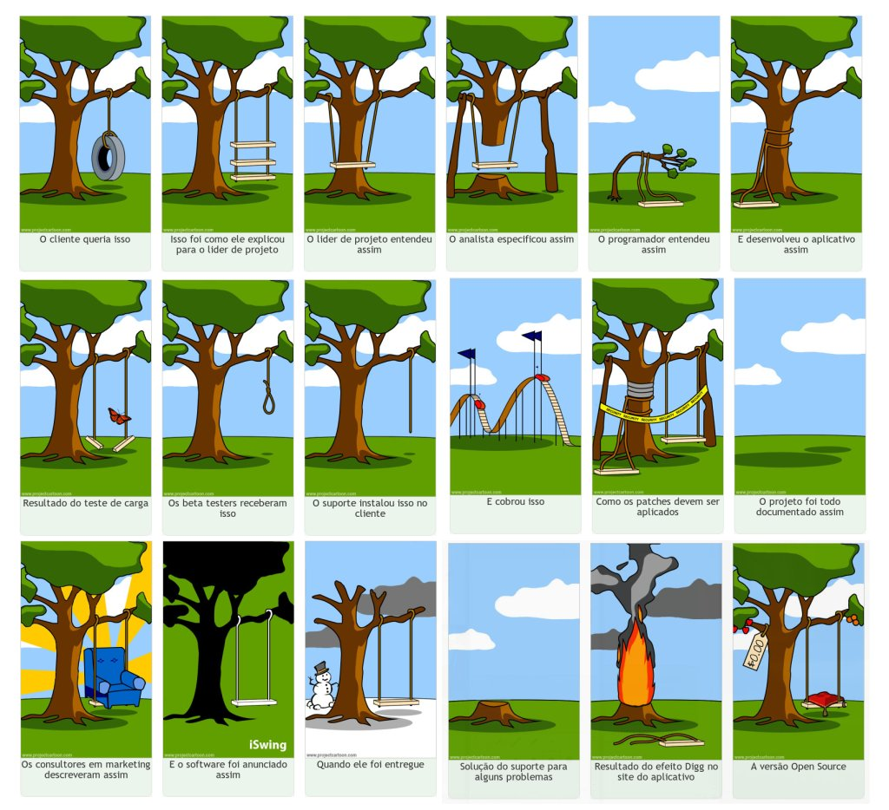

Sou analista funcional, analista de requisitos ou product owner já há um bom tempo. Apesar de todos esses nomes, mesmo quando eu era analista de produto há ainda mais anos atrás, grande parte do meu papel já era esse: levantar e analisar requisitos e principalmente, propor soluções.

Apesar do enorme crescimento da profissão, em grande parte devido a ser um cargo considerado menos técnico (visão que particularmente abomino), vejo ela cada vez mais desvalorizada, até pela confusão em torno do papel e maior atenção de stakeholders e sponsors (os verdadeiros donos e investidores do projeto) à detalhes antes exclusivos do analista. É comum ver gerentes e diretores, altos cargos de organizações, discutindo requisitos e usabilidade e tirando autonomia do analista.

Apesar de, como eu disse, não concordar com a visão de que o papel é menos técnico (programar não é a única atividade técnica em um projeto) concordo que há um certo ar quase artístico e de percepção nas funções do analista funcional.

Só essa frase já arrepiaria os cabelos de puristas envolvidos no mercado de T.I. e amantes da sua completa lógica e até previsibilidade, mas a verdade é que há grandes fatores humanos e espaço para “feelings“.

Lógico que todo feeling também acaba por se originar de experiência, dados estatísticos e tudo o mais que envolve as diversas questões que se colocam, mas defino dessa maneira pois são fatores as vezes difíceis de se corroborar com dados ou mesmo propor testes e análises específicas, ainda mais na velocidade em que são exigidos.

Pois bem, talvez com alguns exemplos, ou mesmo com apenas uma situação hipotética, eu consiga demonstrar o que estou querendo dizer, assim como muitas vezes fazemos ao transmitir qualquer informação…

Devido a todo esse cenário, é comum hoje em dia, você receber informações do tipo: “o requisito é este, fazer esta tela dessa exata maneira”. Isto ocorre justamente pois o diretor possivelmente desenhou uma tela, e ele é muito reticente a quaisquer mudanças e a deturpação do requisitos começa…

A “arte” da definição de requisitos consiste em identificar os reais requisitos por trás de uma informação como essa, por mais difícil que ela seja, até mesmo politicamente. Nesse caso, os requisitos podem ser os mais diversos: fazer toda a operação numa tela só, usar um recurso visual específico, usar uma regra de negócio de bloqueio e validação, entre outros.

A falha em identificar o requisito real, leva a retrabalhos ou mesmo a situações onde toda a equipe se encontra presa à definições que não fazem mais sentido e onde a tão procurada criatividade murcha, quando não some por completo.

A cartilha diz que devemos fazer as decomposições e sínteses necessárias a fim de buscar essas informações, mas na prática, com prazos surreais e stakeholders que praticam uma ditadura (não que ela não tenha sua parcela de importância), cada vez mais a análise vai passando de um processo para uma simples “tomada de pedidos” e é um dos aspectos mais desmotivantes da rotina de um analista.

Quantas vezes vimos casos onde todo o processo foi completamente seguido à risca e o resultado final é um desastre? Onde o prazo era completamente irreal, quiça desnecessariamente e deixou a qualidade em segundo plano?

Sempre que me pego pensando nisso, me lembro do filme A Origem. Ele possui algumas citações muito interessantes e que cabem bem nessa questão da “ideia original”.

> What is the most resilient parasite? Bacteria? A virus? An intestinal worm? An idea. Resilient… highly contagious. Once an idea has taken hold of the brain it’s almost impossible to eradicate. An idea that is fully formed – fully understood – that sticks; right in there somewhere.

Uma ideia, completamente formada e entendida “gruda” e é assim que as informações devem procurar ser moldadas, devemos procurar os detalhes que importam, o que realmente a define.

> The subject’s mind can always trace the genesis of the idea. True inspiration is impossible to fake.

Igualmente a inspiração é original e impossível de ser fingida, sempre enxergo que se o real requisito não for repassado, ele nunca terá a força necessária para espalhar para toda a equipe e para que ela possa dar tudo que tenha de melhor para fazer aquela ideia se tornar real da forma que ela merecia.

Para mim, o grande prazer do papel do analista é a investigação e o uso da criatividade em encontrar soluções para problemas reais. Quaisquer atitudes e procedimentos que fomentem isso irão agregar muita qualidade a todo processo de engenharia de software e aos produtos e à equipe como um todo.

Fonte das citações: [GoodReads](https://www.goodreads.com/work/quotes/13433807-inception-the-shooting-script)