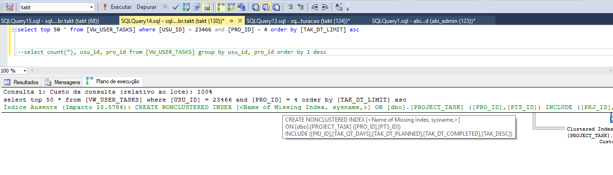

A dica de hoje é para o SQL Server e demonstra como conseguir sugestões de índices de forma simples. Muitas vezes, alguns problemas de performance são causados pela ausência deles, mas fazer a criação manualmente pode exigir um grau de conhecimento um pouco maior.

Claro que, quanto mais você conhecer o funcionamente, melhores decisões você tomará e algumas das variáveis escapam ao servidor no momento da sugestão, como por exemplo, se a perda de performance no INSERT vale e pena pelo aumento no SELECT, na tabela em questão.

Mas minha intenção nesse post não discorrer sobre todas essas variáveis, mas sim demonstrar como você pode facilmente verificar e aplicar a sugestão gerada pelo SQL Server

{: .align-center}

Antes de executar sua query, localize o botão **Incluir Plano de Excução Real (Ctrl + M)** na barra de ferramentas, ou acione o comando informado e depois execute a query normalmente.

Uma nova aba aparecerá nos resultados, chamada **Plano de Execução**, onde você terá várias informações que poderá aproveitar mais ou menos, de acordo com o seu conhecimento. Mas caso haja alguma sugestão, a mensagem **Índice Ausente...** vai aparecer e ao clicar com o botão direito e selecionar **Detalhes de Índice Ausente...** uma nova janela será aberta com o comando prontinho para você executar!

Simples e importante.

Abraços!