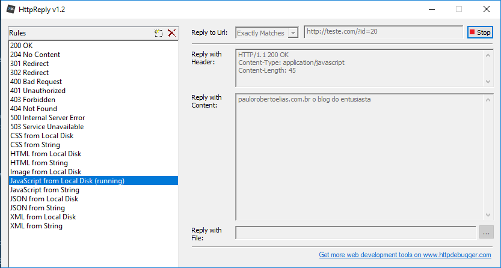
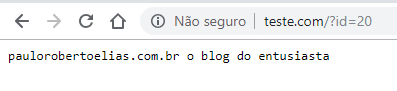

Muitas vezes, quando estamos desenvolvendo uma aplicação em times, acabamos por ter algumas depêndencias entre tarefas, como por exemplo, desenvolver primeiro a API, para depois fazermos o FrontEnd que a consumirá. 

Já é comum optarmos por acelerar o desenvolvimento e mitigar essa dependência por "mockar" a API (palavra já 'aportuguesada') que é quando criamos um servidor falso, que dá uma resposta válida, mas que não foi gerada pela aplicação, ou seja, dá uma resposta estática, embora controlável, para que possamos continuar o trabalho de consumo da API em paralelo.

Um amigo meu do trabalho encontrou um programa muito legal e que facilita muito este processo. É o [HttpDebugger](https://www.httpdebugger.com/download_httpreply.html), que você pode baixar a versão portátil e grátis [aqui](https://www.httpdebugger.com/download_httpreply.html).

Sendo portátil, nem sequer instalar você precisará, bastando iniciar o aplicativo, escolher o tipo de resposta desejada no painél a direita e informando a URL que deseja responder (pode-se usar variáveis na querystring como no meu exemplo abaixo) e acionando o botão *Run*.

{: .align-center}

Feito isto, é possível já validar a resposta digitando o endereço criado, preenchendo diretamente no navegador.

{: .align-center}

É possível inclusive escrever diferentes respostas em JSON em arquivo e alternar entre elas para ter um retorno bem fiel sobre o servidor real e também testar a aplicação para diferentes respostas HTTP, podendo acelerar bastante o seu projeto.

Abraços

