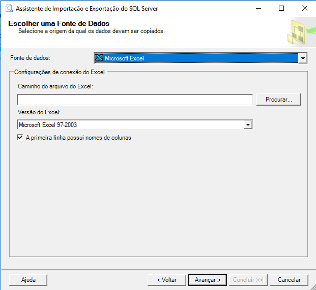

Hoje eu vou registrar como fazer uma importação de dados simples utilizando o SQL Server, a partir de uma planilha Excel. O importador pode ser executado de várias formas e usando vários tipos de arquivo diferentes, mas o Excel é com certeza o mais comum e minha idéia é ser prático e ir direto ao ponto.

Para realizar a importação, sua máquina precisa ter o Microsoft Access Database Engine instalado. Para fazer o download clique [aqui](https://www.microsoft.com/en-us/download/details.aspx?id=13255).

Atente-se para a versão, já que, mesmo a maioria das máquinas sendo 64 bits, caso a mesma possua o Office 32 bits instalado, deverá usar a versão correspondente de 32 bits para funcionar.

Feita a instalação, há várias maneiras de se iniciar o processo, que pode ser através do uso do ícone de *Importar e Exportar Dados do SQL Server* ou clicando com o botão direito do mouse sobre o servidor conectado, no SQL server Management Studio e navegando até *Tarefas > Importar Dados*.

{: .align-center}

> Atenção: mesmo iniciando desta forma, o servidor destino precisa ser configurado.

O processo começará pela fonte de dados, sendo assim, você deve selecionar *Microsoft Excel* e indicar o arquivo.

{: .align-center}

Depois você selecionará a base de dados destino, no caso, precisará selecionar *SQL Server Native Client*, depois o nome do servidor e o tipo de conexão, bem como os parâmetros como usuário e senha, caso a autenticação não seja Windows.

{: .align-center}

Logo após, você poderá selecionar se deseja escrever uma query, mas eu aconselho você seguir com a opção *Copiar dados de uma ou mais tabelas ous exibições*.

Na tela seguinte, você pode configurar o nome que você deseja para a tabela destino, clicando sobre o nome gerado automaticamente na coluna destino.

{: .align-center}

Além disso, clicando em *Editar Mapeamentos*, você terá a possibilidade de alterar tipos e nomes para cada campo, além de outras opções como poder destruir uma tabela de mesmo nome caso a mesma já exista. 

E então é só seguir com a importação e aguardar, o que pode demorar se a quantidade de registros for muito grande. É claro que esta funcionalidade é mais poderosa do que foi demonstrada aqui e há muito mais opções, como por exemplo, salvar o pacote em vez de *Executar imediatamente*, mas as elas são auto-explicativas e você com certeza conseguiria adaptar para o uso mais conveniente para você.

Abraços!

