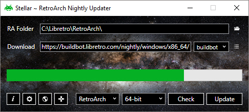

Retroarch é o emulador (ou conjunto de emuladores) mais utilizado, inclusive integrado ao EmulationStation. Já falei sobre o projeto que participo de instalação facilitada deles em máquinas Windows, [aqui](https://paulorobertoelias.com.br/2018-07-04-emulationstation-configuracao-simples-para-windows/). Porém este projeto não trata da parte de atualização, tanto do próprio Retroarch, como dos seus chamados *cores*, que são as DLLs que contém os emuladores em si.

Embora o próprio Retroarch, em sua versão atual, contenha um atualizador, ele não é muito prático, já que você precisa navegar por cada um dos *cores* para fazer o download, além de precisar baixar manualmente também a pasta do Retroarch todo.

Pois bem, lhes apresento hoje o projeto [StellarUpdate](https://github.com/StellarUpdater/Stellar). Apesar de ter apenas instruções em inglês, seu uso é bem fácil, bastando baixar o executável (não precisa instalar) e executar.

Você deve informar a pasta onde encontram-se seus arquivos do Retroarch e selecionar no campo onde está escrito *Retroarch*, para mudá-lo para *RA + Cores*, com isso todas as DLLs que eu mencionei serão atualizadas.

{: .align-center}

E é só isso, bem simples e prático para você ter sempre as últimas versões, que vem avançando bem rápido.

Abraços!