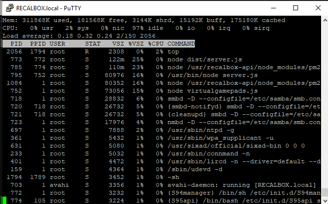

A dica de hoje é para você que possui um sistema Recalbox configurado em seu Raspberry Pi. Você já deve ter percebido que, se você editar seus arquivos ```gamelist.xml``` pelo seu computador Windows, enquanto seu Recalbox estiver ligado, as alterações serão perdidas, pois ele é configurado para salvar informações nesses arquivos ao desligar, como por exemplo, tempos de jogos.

Sendo assim é necessário terminar a aplicação antes de fazer qualquer alteração. Há algumas formas de se fazer isso enquanto se mantém o sistem ligado. Uma delas é conectando um teclado USB ao Raspberry e apertando ```Ctrl-Alt-F4``` (o comando pode variar dependendo da versão). Mas pra mim, a mais prática é conectando via SSH, usando o software [Putty](http://www.chiark.greenend.org.uk/~sgtatham/putty/download.html) (lembrando que tanto seu computador quanto seu Raspberry deverão estar na mesma rede).

Basta abrir o Putty e informar no campo Host Name o valor ```recalbox``` e assim que a janela se abrir, usar o login ```root``` e a senha ```recalboxroot```. Com o terminal aberto, você conseguirá se conectar diretamente de sua máquina Windows e poderá executar comandos. O primeiro comando que você deverá executar é o ```top```.

{: .align-center}

Ele exibe uma lista de todos os processos rodando no computador (no caso no Raspberry) e então, basta você localizar o processo do EmulationStation e anotar o seu **PID**, para depois usá-lo no segundo comando, que é o ```kill```, que você digitará em conjunto com o número do processo encontrado no passo anterior. Com isso a tela do Recalbox ficará preta e você poderá editar o arquivo pelo computador sem correr o risco do mesmo ser sobrescrito ao sair.

Há também um outro comando específico que pode ser usado, que é o ```/etc/init.d/S31emulationstation stop```. O resultado é o mesmo, mas é mais simples, por se tratar de um comando único. Depois de fazer as alterações desejadas, você pode inclusive reiniciar o Recalbox também pelo Putty, executando o comando ```/etc/init.d/S31emulationstation start```. 

Outro software bastante interessante para se conectar e executar comandos e também copiar arquivos (alguns arquivos do Recalbox possuem segurança e não ficam na pasta *share*) é o [WinSCP](https://winscp.net/eng/download.php). Com ele é possível ter um visualização semelhante ao *Windows Explorer* mas permitindo facilmente se logar como *root*. Mas lembre-se de ter muito cuidado ao mexer nos arquivos com esse nível de acesso, pois você pode fazer besteira...

Referências:  
[Quitting EmulationStation via SSH](https://www.reddit.com/r/RetroPie/comments/4klpw7/quitting_emulationstation_via_ssh/)  
[Root access on terminal](https://github.com/recalbox/recalbox-os/wiki/Root-access-on-terminal-(EN))  
[Gamelist can't retain custom file](https://batocera-linux.xorhub.com/forum/d/1790-gamelist-xml-cant-retain-custom-file/20)  
[SSH files & Commands](https://github.com/recalbox/recalbox-os/wiki/SSH-Files-&-Commands)  


