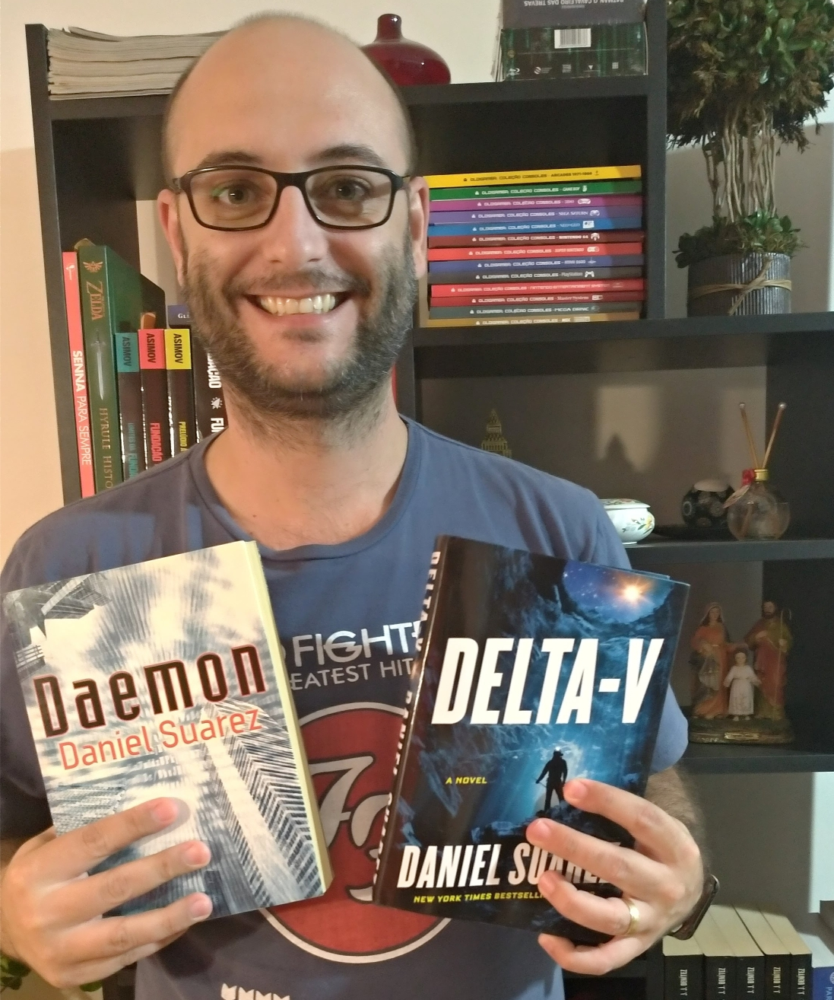
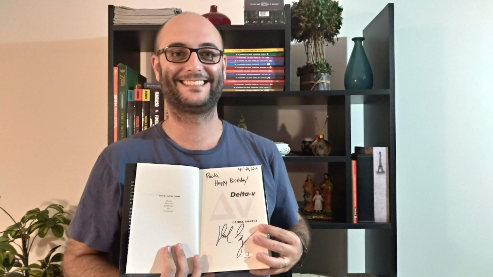

Esse ano recebi um presente de aniversário muito inesperado e inesquecível, que só foi possível pela existência e facilidade das redes sociais. Eu simplesmente ganhei um livro diretamente de um dos meus autores preferidos, o [Daniel Suarez](https://daniel-suarez.com/).

Eu comecei a acompanhá-lo depois de ler um de seus livros, chamado [Daemon](https://www.estantevirtual.com.br/livros/daniel-suarez/daemon/300849345). Nesse livro de ficção científica policial, um bilionário criador de games morre, mas deixa um software autônomo conectado na internet e que tem potencial para modificar toda a socidade (eu sei, talvez você esteja se lembrando de Ready Player One, mas Daemon foi lançado antes). Simplesmente obrigatório para todo fã de sci-fi, recomendo muito!

{: .align-center}

> Eu e meus 2 livros físicos do autor, tenho também [Freedom](https://www.amazon.com.br/dp/B004IPQEAS/ref=dp-kindle-redirect?_encoding=UTF8&btkr=1) em sua versão ebook

Foi então que vi que seu mais novo livro, Delta-V (ainda sem versão em Português), seria lançado justamente no dia do meu aniversário! Que foi no último dia 23 de abril. Como quem não quer nada, eu simplesmente o pedi de presente, confiante que ele seria seduzido pela coincidência e para minha supresa, ele muito gentilmente me enviou uma cópia!

{: .align-center}

> Com direito à dedicatória, claro

Infelizmente, os Correios brasileiros, como todos nós aqui neste país sabemos, não funciona muito bem. Então, mesmo ele me enviando bem a tempo de eu receber justo no dia meu aniversário, não foi possível, pois o livro ficou parado na alfândega. Mas não tem problema nenhum, pois isso não diminui a minha felicidade com essa história toda que eu jamais esquecerei!

Um grande abraço para você Daniel e muito sucesso para que você continue nos brindando com esses ótimos livros!

ps.: aguardem minha crítica pois ela virá com certeza.

Até a próxima

