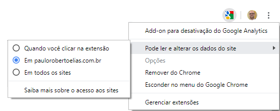
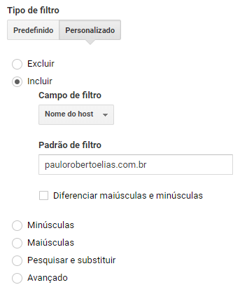

Quando você tem um projeto de site particular ou mesmo para algum cliente, você fatalmente irá querer controlar ou acompanhar quantos visitantes você recebe.

O problema é que, quando você está começando e tem bem poucos acessos, os seus próprios hits (visualizações), serão uma distorção chata de acompanhar nos números e você pode querer, assim como eu, não contabilizar seus próprios acessos.

Para isso, eu recomendo que você instale essa extensão do Google Chrome, que é oficial e faz o trabalho de forma rápida e fácil. [Download aqui](https://chrome.google.com/webstore/detail/google-analytics-opt-out/fllaojicojecljbmefodhfapmkghcbnh)

Após instalar, basta clicar com o botão direito no ícone e configurar para o domínio desejado (é necessário visitá-lo), caso queira eliminar as visitas apenas daquele site específico e não de todos os que você navega.

{: .align-center}

Além disso, será muito importante você filtrar visualizações spam. Essas visualizações podem ser robôs ou mesmo inserções indevidas no Google Analytics e que vão apenas te confundir e inflar os números, não significando um acesso real. Embora inflar os números possa parecer muito legal, isso vai distorcer outros números, como por exemplo, o tempo de permanência na página, já que esses bots não costumam ficar parados lendo seu conteúdo.

Para isso, acesse a guia ```Administrador``` e acione o botão ```+ Criar vista```. Isso garantirá que você não acabe estragando a **vista padrão** e também possa comparar e verificar o quanto de spam está recebendo e não perder nenhum histórico.

Depois, mude para a nova vista no menu superior e navegue novamente até a administração e dessa vez, vamos clicar em ```Filtros``` e criar um novo como na imagem abaixo:

{: .align-center}

E é só isso. O confuso nesta parte é que, caso você já tenha o seu site no ar há algum tempo, o filtro fará com que todas suas visitas antigas desapareçam (nesta visão, por isso criamos outra, é só mudar novamente no menu superior), acredito que seja devido aos dados não terem guardados para as informações de host que permitiriam o filtro, no caso dos dados antigos.

Um abraço a todos.