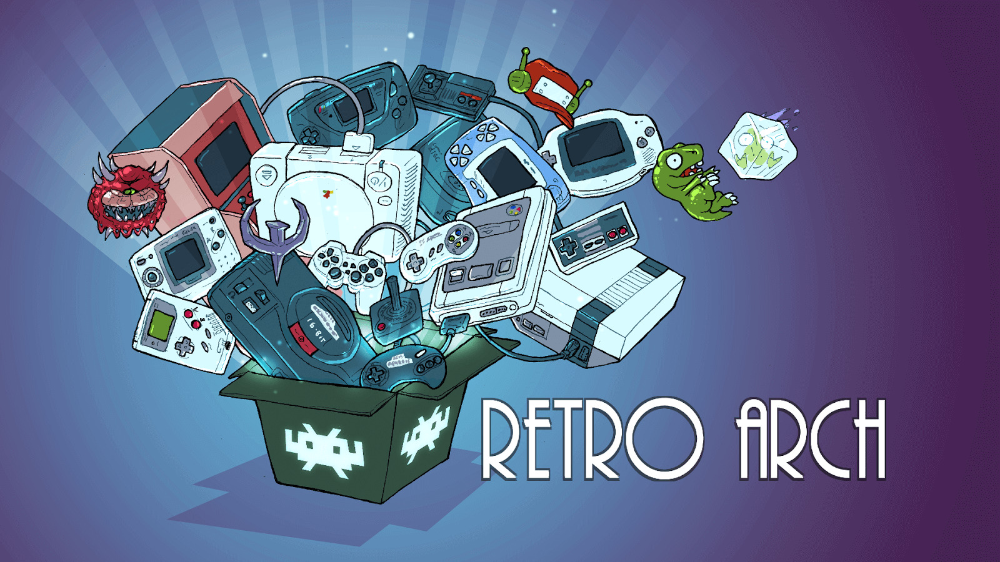

Hoje gostaria de lhes apresentar meu mais novo projeto pessoal OpenSource. Eu o chamei de **Retroarch Panel**. Como você pode deduzir pelo nome, ele é relacionado ao emulador Retroarch, embora esteja mais focado em seu uso junto com um Raspberry PI com Recalbox ou Retropie.  

{: .align-center}  

O projeto consiste em um Website local para exibição de dados extraídos dos arquivos ```gamelist.xml```, bem como imagens, última data jogada e quantidade de vezes.  

  

Conforme é possível ver no GIF acima, capturado da versão atual, é possível pesquisar pelos jogos e até mesmo exportar para um arquivo Excel, o que pode ser bem útil se você tiver várias imagens ou cartões SD diferentes e deseja um melhor controle da sua coleção.

No [repositório do projeto no GitHub](https://github.com/PRElias/retroarch-panel) você encontrará um pequeno passo-a-passo de como utilizar e informações como o roadmap do projeto (implementações futuras), além do link para download.

Quaisquer dúvidas, sugestões ou mesmo se quiser participar do projeto, é só me dar um alô.

Obrigado e abraço a todos!