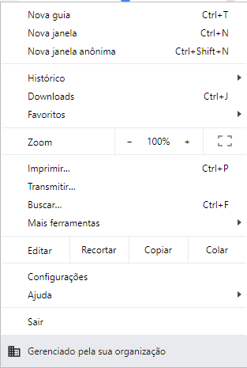

Se você está tendo o problema do Google Chrome exibindo essa mensagem:

{: .align-center} 

Mesmo em seu computador pessoal, que não é gerido por nenhuma organização e, assim como eu, se incomoda com esse tipo de bug, saiba que isso pode ser contornado (infelizmente, temporariamente), através de uma edição do registro do Windows.

```[HKEY_LOCAL_MACHINE\SOFTWARE\Policies\Google\Chrome]```

A chave acima pode ser apagada usando o ```regedit``` do Windows e após essa ação, basta vcê reiniciar o Google Chrome e a mensagem terá desaparecido.

Como eu disse, infelizmente essa correção é temporária, já que a chave volta a ser criada, mas 
