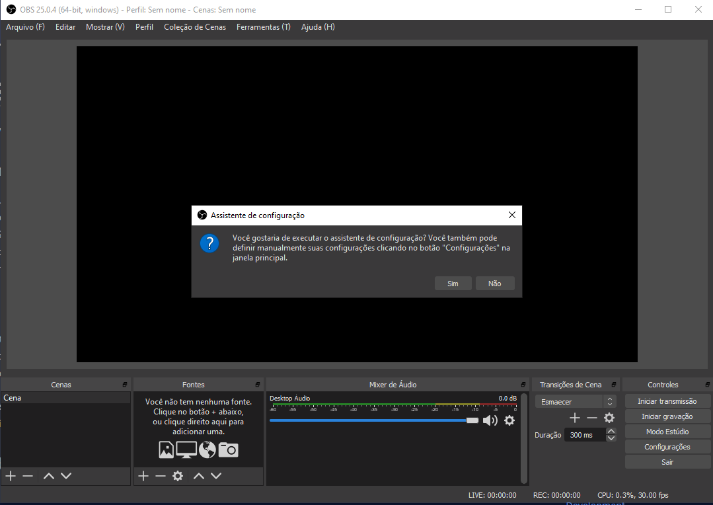
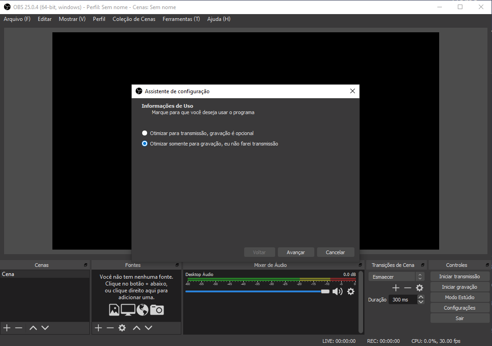
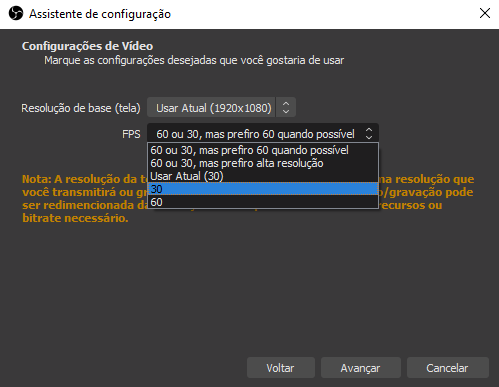
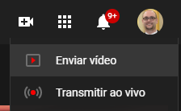

Nesses dias de quarentena e pandemia, muita gente vem trabalhando de casa, o famoso **home office**. Sabendo que muitas pessoas tem dificuldades em realizar certas atividades, como gravar um vídeo, fazer uma transmissão ao vivo, ou mesmo montar reuniões, minha idéia foi criar uma série de posts para ajudar quem precisa.

E nesse primeiro artigo eu vou demonstrar como gravar um vídeo no seu PC ou notebook com Windows, fazendo uso da câmera do computador, junto à uma transmissão da tela, como um arquivo Powerpoint.

## Instalando o software

Para isso, usaremos um software grátis, chamado OBS, do Inglês *Open Broadcast Software*. Para baixá-lo, basta usar este [link](https://cdn-fastly.obsproject.com/downloads/OBS-Studio-25.0.4-Full-Installer-x64.exe).

Assim que terminar a instalação, se você não desmarcou a opção, o software abrirá sozinho (caso contrário o ícone deverá estar na sua área de trabalho). Ele apresentará uma série de mensagens para que você faça uma configuração básica. Siga conforme abaixo:

{: .align-center} 
> Clique em sim para executar o assistente.

{: .align-center} 
> Eu sugiro usar a otimização para gravação, deve acabar configurando para as melhores qualidades de som e imagem, mas não faz tanta diferença...

{: .align-center} 
> Já nessa configuração eu sugiro deixar em 30, já que em 60 o vídeo ficará bem maior e acho desnecessário para a maioria dos tipos de conteúdo. Lembrando que você pode mudar essas configurações depois, caso vá aprendendo mais sobre o software.

## Gravando o vídeo

E pronto, o software já está instalado e com as configurações básicas. Para a sequência da explicação, eu achei melhor gravar um vídeo, que você pode assistir aqui:

<iframe width="560" height="315" src="https://www.youtube.com/embed/VlI4teTYvpk" frameborder="0" allow="accelerometer; autoplay; encrypted-media; gyroscope; picture-in-picture" allowfullscreen class="align-center"></iframe>

Como você pode ver no vídeo, usar o software é bem fácil. Depois de gravado, você ainda precisa fazer o upload do seu vídeo, seha para o Youtube ou qualquer outro sistema ou site que você utilize.

## Fazendo o upload

No Youtube, é só você clicar no ícone de + próximo ao seu usuário, no canto superior direito e depois em *Enviar vídeo*. Na tela que se abrirá, é só você apertar o botão e depois indicar o arquivo, que por padrão, estará na pasta **Vídeos** do Windows.

{: .align-center} 

## Finalizando

Depois de terminado o upload, seria interessante você revisar as configurações do vídeo, principalmente a opção **Visibilidade**. Caso queira que ele não apareça no seu canal e apenas as pessoas com o link possam vê-lo, basta deixar essa opção como **Não listado**. Caso você opte por deixar público, ele obviamente ficará totalmente disponível e como privado, apenas o seu usuário poderá acessá-lo.

Mesmo antes do final do processo de upload, que pode demorar bastante, já é possível copiar o endereço que o vídeo será disponibilizado, clicando no mesmo na janela vídeos do canal. E é isso! Agora é só compartilhar o vídeo. 

Como você provavelmente está no PC, pode achar isso complicado caso não use o Whatsapp Web, mas é muito fácil, basta clicar [aqui](https://web.whatsapp.com) e no app do celular ir até a opção **Whatsapp Web** e apontar a câmera do seu celular para o QR Code na tela do seu PC.

O software aqui apresentado, o OBS, também pode ser usado para transmissões ao vivo para o Youtube, mas isso eu explico num próximo post.

Obrigado e boa sorte a todos. Lembrando que em caso de dúvidas, vocês podem deixar comentários aqui na página e eu terei prazer em ajudar.

Até mais!

