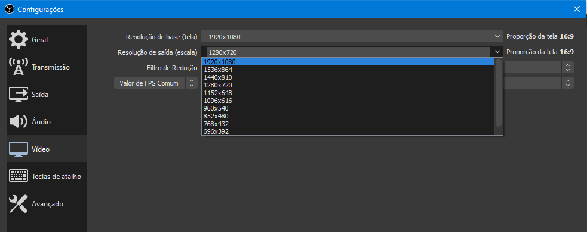
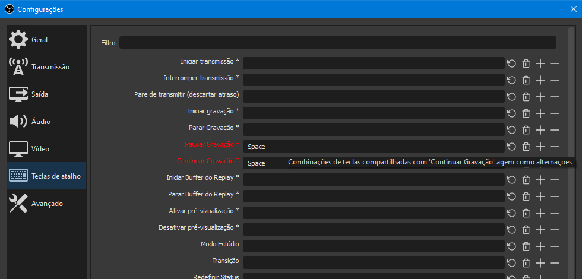

Conversando com minha irmã, que é professora e uma das pessoas que eu quis e consegui ajudar com essa explicação, notei algumas dificuldades que o OBS trouxe para ela e então, decidi escrever mais um post com algumas dicas, que podem ser muito úteis para agilizar a gravação e publicação dos vídeos.

## Alterando a resolução do vídeo

Provavelmente a configuração padrão do seu OBS esteja renderizando o vídeo em FullHD (1920x1080 pixels), que é uma resolução alta e, embora resoluções maiores signifiquem qualidades maiores de imagem, essa resolução pode não ser necessária para a finalidade que você está gravando.

Qualidades maiores resultam em arquivos maiores e fazer o upload para o Youtube pode ficar muito demorado.

Sendo assim, eu sugiro resoluções próximas ao HD, como 1366x768 ou 1280x720 (as resoluções que aparecerão terão relação com o seu computador e podem não ser as mesmas para todo mundo).

Para alterar, clique no botão *Configurações*, que fica no canto-inferior direito da tela do OBS, ou pelo menu, indo até *Arquivo (F) > Configurações* e depois no botão *Vídeo* no lado esquerdo da janela que se abrirá. E altere conforme na imagem abaixo:

{: .align-center} 
> O mais importante é o segundo campo, *Resolução de saída (escala)*. É ele quem vai definir a qualidade e o tamanho do arquivo de vídeo gravado.

## Configurando uma tecla para pausa

É muito comum que você queira pausar rapidamente o vídeo, seja para fazer qualquer coisa alheia à gravação ou para trocar de fonte, de tela, de material, etc.

Contudo, se você não quiser que apareça o seu movimento ao fazer isso no vídeo, ou o seu rosto enquanto procura a opção no programa, você pode configurar uma tecla de atalho.

Para isso, o caminho das configurações é o mesmo ensinado acima, porém, dessa vez você clicará no botão *Teclas de atalho* da janela de configurações.

Como você pode perceber, há diversas opções, mas a que eu recomendo, para que você não se atrapalhe, é a *Pausar gravação*. Para isso clique no campo correspondente e aperte a tecla que gostaria de usar (eu recomendo o espaço por ele ser maior e mais fácil de ser encontrado na pressa).

{: .align-center} 
> Sugiro sempre marcar os dois campos, como na imagem abaixo, para que você possa usar a mesma tecla e alternar entre pausar e continuar

É isso, espero que essas dicas possam ajudar mais alguém e lembrando que, se tiverem dúvidas, é só entrar em contato.

Abraço a todos
