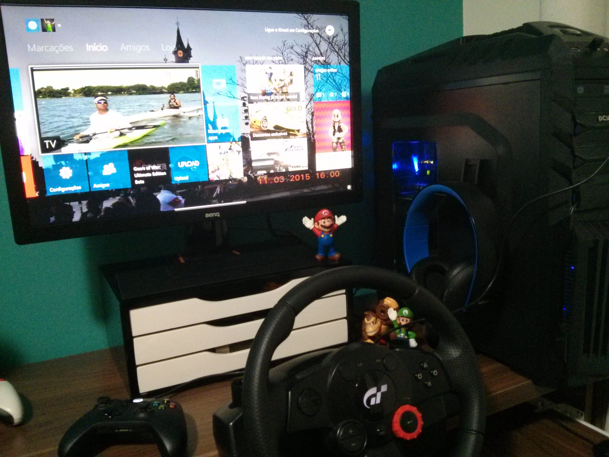
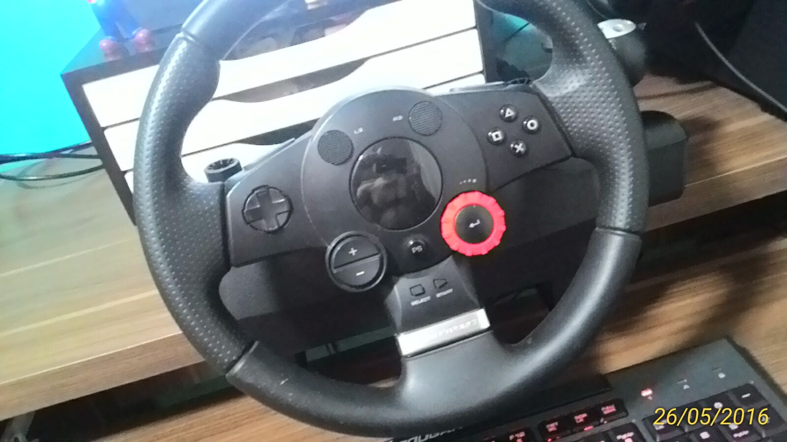
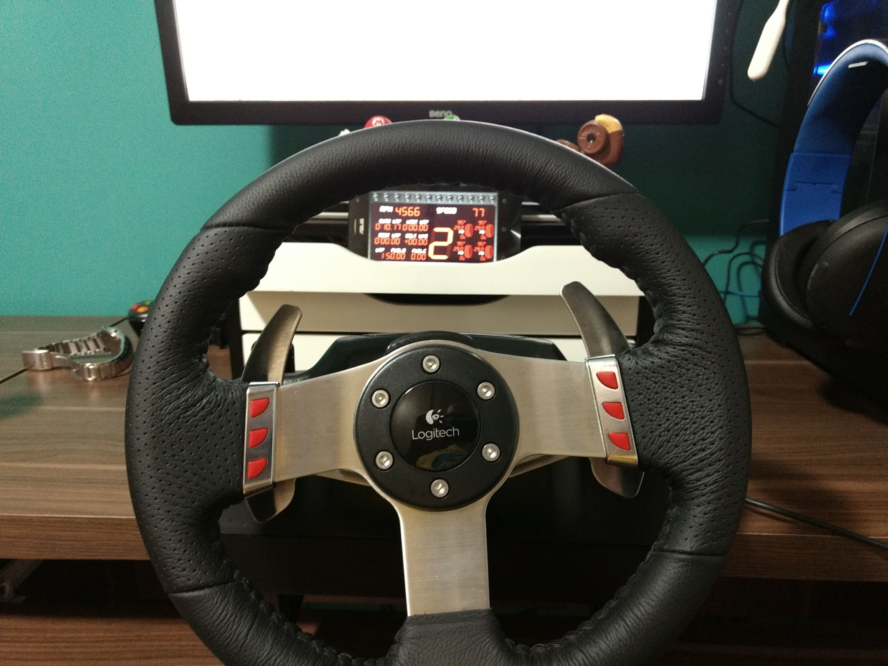
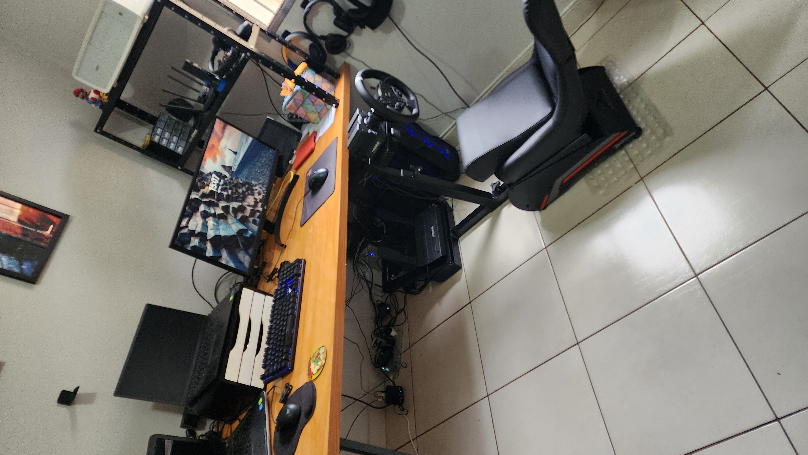

Sim, SimRacing é nada mais nada menos que um videogame de corrida de carros (ou motos, mas normalmente elas não fazem parte desse universo). Entretanto há sim uma pegada diferente, um foco mais sério. Os jogos de automóveis são tantos e variados que possuem classificações. Geralmente dividem-se entre arcades (que possuem pouco compromisso com a realidade, leis da física e afins) ou simuladores e mesmo entre essas categorias, ainda temos sub grupos como drift, rally e até mesmo jogos com físicas reais mas que simulam cenários como transportadoras ou até passeios.

Eu sempre gostei de jogos de corrida e é o estilo de jogos que mais possuo com mais de 30 títulos originais (eu vinha catalogando meus jogos há alguns anos mas a quantia aumentou tanto que perdi o controle).

Os jogos que visam replicar situações reais estão tão sofisticados que muitos deles já vem substituindo aquelas famosas e obscuras simulações que as equipes de corrida reais usam para treinamento de pilotos.

> O piloto Lucas di Grassi citando o jogo RFactor 2 como treinamento para corridade de Formula E
<iframe width="560" height="315" src="https://www.youtube.com/embed/q2fQtTsdGqc" title="YouTube video player" frameborder="0" allow="accelerometer; autoplay; clipboard-write; encrypted-media; gyroscope; picture-in-picture; web-share" allowfullscreen></iframe>

> Jogo oficial oferece até campeonatos com premiações reais
[link](https://traxion.gg/formula-es-esports-competition-returns-gen3-cars-and-e40000-prize-pool/?utm_source=pocket_saves)

E por que eu decidi escrever esse post e qual a intenção dele? Como sempre digo, se há algo que não falta hoje em dia é material online, (ainda mais em tempos de inteligência artificial) então minha intenção passa longe de um caráter de intrução ou apresentação de novidades e dicas difíceis de achar. Eu escrevo porque gosto e para relembrar, talvez quem sabe consultar no futuro e observar mudanças nas informações e na forma que as expus. Porém, se fosse pra definir um objetivo menos egóista para esse texto, eu diria que escrevo para as pessoas que se interessam mas nunca tiveram sequer a oportunidade de experimentar ou mesmo talvez nem tenham noção alguma do que existe ou é possível dentro desse universo da simulação de corridas.

## Do real para o virtual

Muitos pilotos estão vendo na internet uma possibilidade de expandirem sua fama, sua imagem e se divertirem através do SimRacing, como Vitor Genz e [Daniel Morad](https://en.m.wikipedia.org/wiki/Daniel_Morad)  

## Volantes

Volantes não são obrigatórios nesses jogos (ao menos na maioria deles), mas eles fazem toda diferença que você pode imaginar. Entre eles as diferenças são sutis, desde que possuam o chamado Force Feedback. E eu posso falar com certa propriedade já que jogo com controles desde os primórdios com resultados bem gratificantes (nunca pude comparar tempos de forma mais concreta pois acho que nunca joguei pra valer o mesmo jogo das duas formas, talvez agora com Gran Turimoso 7 eu possa fazer isso um dia).

Sem dúvida alguma, em se tratando da sua performance, o impacto será maior a partir da qualidade dos pedais e não do volante em si, embor ele possa sim trazer muitom mais precisão e quem sbe te salvar de alguns giros indevidos lhe transmitindo a força do carro girando após seu erro.

Mas estes são acessórios caros e por isso mesmo acabam por afastar a entrada de novos jogadores nesse universo, porém, estudando um pouco as opções é sim possível encontrar volantes com recursos bem legais com preços mais atraentes. Listarei aqui uma breve descrição dos modelos que já possui ou possuo.

### Logitech Driving Force GT

{: .align-center}  
{: .align-center}  

### Logitech G27

{: .align-center}  

### Thrustmaster T300 RS GT Edition

### Moza R5

{: .align-center}  
{: .align-center}  

## O cenário ideal para óculos de realidade virtual

## Jogos

### Gran Turismo 7

### Assetto Corsa

### Assetto Corza Competizione

### Automobilista 2

### IRacing

> Corrida divertida online no IRacing em que terminei em 10º
<iframe width="560" height="315" src="https://www.youtube.com/embed/oq22ZnxIa84" title="YouTube video player" frameborder="0" allow="accelerometer; autoplay; clipboard-write; encrypted-media; gyroscope; picture-in-picture; web-share" allowfullscreen></iframe>

