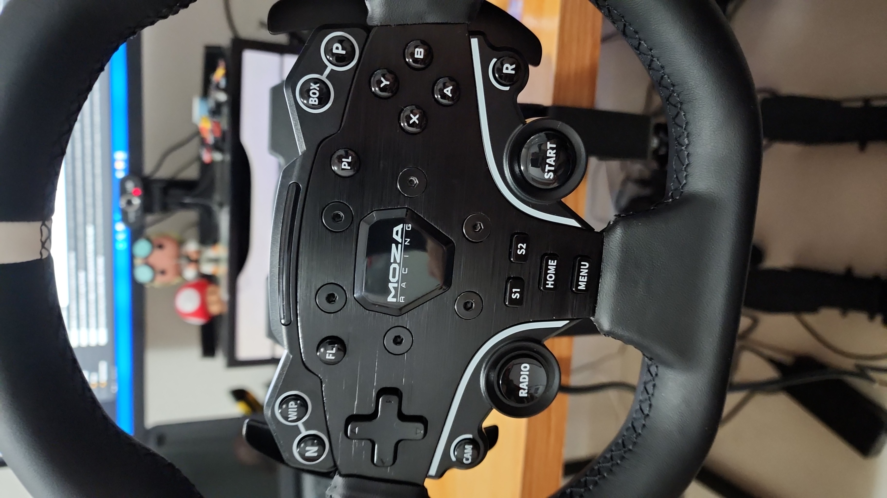

Sim, SimRacing é nada mais nada menos que um videogame de corrida de carros (ou motos, mas normalmente elas não fazem parte desse universo). Entretanto há sim uma pegada diferente, um foco mais sério. Os jogos de automóveis são tantos e variados que possuem classificações. Geralmente dividem-se entre arcades (que possuem pouco compromisso com a realidade, leis da física e afins) ou simuladores e mesmo entre essas categorias, ainda temos sub grupos como drift, rally e até mesmo jogos com físicas reais mas que simulam cenários como transportadoras ou até passeios.

Eu sempre gostei de jogos de corrida e é o estilo de jogos que mais possuo com mais de 30 títulos originais (eu vinha catalogando meus jogos há alguns anos mas a quantia aumentou tanto que perdi o controle).

Os jogos que visam replicar situações reais estão tão sofisticados que muitos deles já vem substituindo aquelas famosas e obscuras simulações que as equipes de corrida reais usam para treinamento de pilotos.

> O piloto Lucas di Grassi citando o jogo RFactor 2 como treinamento para corridade de Formula E
<iframe width="560" height="315" src="https://www.youtube.com/embed/q2fQtTsdGqc" title="YouTube video player" frameborder="0" allow="accelerometer; autoplay; clipboard-write; encrypted-media; gyroscope; picture-in-picture; web-share" allowfullscreen></iframe>

> Jogo oficial oferece até campeonatos com premiações reais
[link](https://traxion.gg/formula-es-esports-competition-returns-gen3-cars-and-e40000-prize-pool/?utm_source=pocket_saves)

E por que eu decidi escrever esse post e qual a intenção dele? Como sempre digo, se há algo que não falta hoje em dia é material online, (ainda mais em tempos de inteligência artificial) então minha intenção passa longe de um caráter de instrução ou apresentação de novidades e dicas difíceis de achar. Eu escrevo porque gosto e para relembrar, talvez quem sabe consultar no futuro e observar mudanças nas informações e na forma que as expus. Porém, se fosse pra definir um objetivo menos egóista para esse texto, eu diria que escrevo para as pessoas que se interessam mas nunca tiveram sequer a oportunidade de experimentar ou mesmo talvez nem tenham noção alguma do que existe ou é possível dentro desse universo da simulação de corridas.

## Do real para o virtual

Muitos pilotos estão vendo na internet uma possibilidade de expandirem sua fama, sua imagem e se divertirem através do SimRacing, como Vitor Genz e [Daniel Morad](https://en.m.wikipedia.org/wiki/Daniel_Morad).

Vitor é brasileiro e piloto de Stock Car inclusive com vitória, como ele mesmo sempre gosta de lembrar e além de de expor suas corridas no Youtube e no Instagram, vende cursos online de mentoria para pilotos que desejam evoluir sua técnica e ter resultados melhores.

Mas as opções de Youtubers dedicados ao SimRacing são vastas, apesar de nenhum canal apresentar realmente um número massivo de inscritos ou visualizações, sendo obviamente mais fácil encontrar opções em inglês.

Aliás, o lado eSport da categoria patina há anos para emplacar, tendo até mesmo campeonatos oficiais de Fórmula 1 e Le Mans e alguns com participações pra lá de especiais até mesmo de Max Verstappen!

## Volantes

Volantes não são obrigatórios nesses jogos (ao menos na maioria deles), mas eles fazem toda diferença que você pode imaginar. Já entre eles as mudanças são sutis, desde que possuam o chamado Force Feedback. E eu posso falar com certa propriedade já que jogo com controles desde os primórdios com resultados bem gratificantes (nunca pude comparar tempos de forma mais concreta pois acho que nunca joguei pra valer o mesmo jogo das duas formas, talvez agora com Gran Turimoso 7 eu possa fazer isso um dia).

Sem dúvida alguma, em se tratando da sua performance pessoal, o impacto será maior a partir da qualidade dos pedais e não do volante em si, embora ele possa sim trazer muito mais precisão e quem sabe te salvar de alguns giros indevidos lhe transmitindo a força do carro rodando após seu erro.

Mas estes são acessórios caros e por isso mesmo acabam por afastar a entrada de novos jogadores nesse universo, porém, estudando um pouco as opções é sim possível encontrar volantes com recursos bem legais com preços mais atraentes. Listarei aqui uma breve descrição dos modelos que já possui ou possuo.

### Logitech Driving Force GT

Esse foi meu primeiro volante e nada se compara a primeira experência com algo desse tipo. O impacto de ir de um joystick para um volante é muito considerável e apesar dele ser de plástico e ter bem pouca força, já me permitiu sentir uma diferença enorme.

{: .align-center}  
{: .align-center}  

### Logitech G27

O Logitech G27 talvez seja o maior clássico da história dos volantes para videogame. Com sua história começando no G25 e chegando aos novos modelos da linha G29 e suas variações, trata-se de um volante muito bom e com um custo benefício imbatível.

{: .align-center}  

Os pedais dos volantes Logitech tem uma qualidade muito boa e oferecem precisão suficiente para você evoluir muito também.

### Thrustmaster T300 RS GT Edition

Fiz o upgrade do G27 para este volante mais pensando na compatibilidade com o Playstation 5 e minha vontade de jogar Gran Turismo 7. Nunca fui realmente convencido de que o upgrade valeu a pena, apesar de eu ainda manter esse volante justamente por isso, já que meu novo Moza não é compatível com videogames (talvez com um dispositivo como o [Raslution 2](https://www.brookaccessory.com/detail/72705806/), que eu também possuo, venha a ser compatível no futuro).

É um volante que se diz ter o dobro de força dos Logitech (algo em torno dos 3 newton metro versus 1.5 dos modelos Logictech) e que funciona à base de correias em detrimento à engrenagens, sendo mais silencioso, mas pelo meu uso, mais propenso a problemas de aquecimento.

### Moza R5

Agora comprei meu primeiro volante de primeiro escalão. É um chamado Direct Drive. Como disse não introdução, não vou adentrar pormenores que são tão fáceis de se encontrar na internet hoje em dia, mas em poucas palavras o force feedback não usa correias ou engrenagens e o seu movimento é forte e suave, muito mais parecido com um carro real.

{: .align-center}  
{: .align-center}  

Detalhar a real diferença na sensação entre as tecnologias não é tarefa fácil. Há simplesmente milhares de vídeos e textos comparativos e eu mesmo consumi diversos deles e em nenhum encontrei algum adjetivo que realmente me convencesse, mas nada me impede de tentar com minhas próprias palavras.

O fato deles serem mais fortes (dentre eles o meu é dos mais fracos) já é metade da diversão desses caros brinquedos e essa força permite, além de sentirmos melhor a força do carro resistindo à mudança de direções, uma maior gama de efeitos, já que eles tendem a se sobrepor menos, como por exemplo, uma vibração ao mesmo tempo do torque sem que um sobreponha o outro.

Minha empolgação com o novo volante é tanta que é um dos motivos desse texto e pretendo escrever uma avaliação mais detalhada dele no futuro. Quem sabe...

## Correndo em Realidade Virtual

Simplesmente nenhuma experiência de realidade virtual se compara ao uso em um cockpit simulado de um carro de corrida. Muito pelo fato do primeiro plano ser parado em relação ao exterior da cabine e o movimento ser controlado por pedais e não direcionais, fato que evita quase por completo também o enjôo que é característico desses dispositivos, mas eu digo pela minha própria experiência com meu HP Reverb G2, onde não consigo jogar ou gostar de nenhum software de VR enquanto não consigo mais não usá-lo para correr.

Infelizmente a usabilidade desses aparelhos ainda deixa um pouco a desejar, sendo constantes os problemas com perda de resposta dos controles, te obrigando a trocar e voltar para a aplicação do jogo para ter tudo funcionando novamente. Fora que a performance do seu computador precisará ser maior e haverá muito material para você estudar em busca de extrair o máximo de potencial, já que a maioria dos jogos não oferece um suporte realmente nativo e opções fáceis de escolher.

Mas posso lhe garantir, a sensação do 3D proporcionado pelo óculos lhe dará uma experiência muito mais imersiva e próxima da realidade.

## Jogos

Hoje as opções de jogos são muitas e seu fosse falar delas aqui ia acabar me extendendo demais. Há muitas ótimas opções para consoles e computadores, entre as quais eu destaco o iRacing, Raceroom Expercience, Automobilista, Assetto Corsa, além de F1 2022 e Dirt Rally.

Mas algumas delas, as quais eu mais venho jogando vou apresentar apenas umas informações rápidas e que podem ser interessantes.

### Gran Turismo 7 e Forza Motorsport

GT7 como é conhecido é sem dúvida a melhor opção de corridas para consoles, mas correndo lado a lado com o quase igualmente famoso Forza Motorsport da Microsoft. Este que hoje em dia é mais conhecido pelo seu irmão mais novo, Forza Horizon, mas que tem previsto um novo jogo para o fim desse ano.

Gran Turismo é sem dúvida o mais belo jogo de corridas já desenvolvido e é bem gostoso de jogar, mas a falta de um modelo de danos aos carros atrapalha bastante a expêriencia, não só pelo visual mas pela diferença que isso causa na maneira de pilotar. É muito comum ver pilotos usando e abusando disso para se apoiar nos adversários ou mesmo jogá-los longe sempre que possível.

### Assetto Corsa

Assetto Corsa já é um jogo antigo, quase um clássico. Tanto que já temos anunciado para o ano que vem, Assetto Corsa 2. Mas esse jogo não deve morrer tão cedo, nem mesmo com a chegada de um sucessor.

Devido ao suporte a mods, as novidades nesse jogo são simplesmente infinitas, chegando a extremos como inclusão de chuva realista por desenvolvedores independentes!

São milhares os sites e grupos de Facebook com discussões e mods para baixar e jogar grátis (há alguns pagos também) e muito é devido à existência de um projeto chamado [Content Manager](https://acstuff.ru/app/). Ele é uma interface de configuração do jogo que permite instalar os mods muito facilmente, assim como diversas configurações do jogo e iniciar tudo muito rapidamente sem nem precisar carregar o menu do game. Permitindo inclusive que configurações sejam compartilhadas com seus amigos em formato de arquivos.

As opções são tantas que este é um jogo que talvez mereça também um post à parte mas o que posso dizer é que é um jogo barato e para o qual é possível correr online de forma gratuita assim como conseguir novas pistas e carros.

Há também um spin-off chamado Assetto Corza Competizione, que trás apenas corridas GT e é uma das melhores experiências disponíveis, mas pelo seu caráter menos abrangente nos modelos e o fato de exigir computadores um pouco mais modernos, faz com que este jogo não alcance o mesmo número de fãs do primeiro, apesar de ser mais utilizado no ceneário competitivo através de um já famoso site de corridas online chamado [Low Fuel Motorsport ou LFM](https://lowfuelmotorsport.com/).

### Automobilista 2

Talvez um dos mais equilibrados jogos da atualidade e desenvolvido por uma empresa brasileira! Tudo bem que a engine, a plataforma na qual o jogo foi desenvolvido é estrangeira. A base é o jogos Project Cars 2 e a Reiza apenas comprou os direitos e modificou o jogo para lançá-lo de forma mais completa e caprichada.

É um jogo lindo e com um vasto conteúdo. Também possui diversas comunidades de fãs apaixonados mundo afora e possui uma física muito gostosa e divertida, com destaque aos efeitos sonoros e de clima que podem inclusive serem configurados para apresentarem a condições reais por data!

### IRacing

Sem dúvida nenhuma, o mais controverso dos jogos é o iRacing, carinhosamente chamados por muitos de nós brasileiros de "iRico". É um software comercializado em modelo de serviço, ou seja, você não adquire o jogo, mas sim assina, como faz com serviços como Netflix e para piorar, apesar do pacote incluir pistas e carros, você terá que acabar adquirindo esses itens de forma separada caso deseje e consiga subir para correr nos rankings mais altos.

E são justamente esses rankings que são a alma do jogo. Ele possui um sistema inigualável de pontuação que classifica os jogadores pela sua perícia e resultados, permitindo uma maior disputa, cuidado para fugir de acidentes e nivelamente entre os pilotos. Graças também a sua base muito grande de usuários, que diferentemente dos modos online de outros jogos está sempre praticamente cheio, fazendo com que você sempre tenha opções pra correr a qualquer hora.

Venho correndo bastante no iRacing e cheguei até fazer um vídeo pra tentar desmontrar como é e você pode conferir abaixo:

<iframe width="560" height="315" src="https://www.youtube.com/embed/oq22ZnxIa84" title="YouTube video player" frameborder="0" allow="accelerometer; autoplay; clipboard-write; encrypted-media; gyroscope; picture-in-picture; web-share" allowfullscreen></iframe>
> Corrida divertida online no IRacing em que terminei em 10º

# Considerações finais

Se você já teve minimamente a oportunidade de jogar um jogo de corrida, nem que seja o clássico Need for Speed Undergound, acredito que você possa ter uma ideia superficial de tudo que comentei aqui e se isso te atraiu eu realmente sugiro que você comece por um volante usado, se for o caso, assim como eu fiz e dê uma chance a esse hobby. 

Apesar de correr o risco de fazer investimentos cada vez mais altos, como eu nos meus upgrades que descrevi aqui, posso garantir que cada centavo gasto valeu a pena e como as horas de diversão foram e tendem a serem muitas aindas, acho que todo o investimento acaba por ser pagar e realmente valer a pena.

Abraços.

