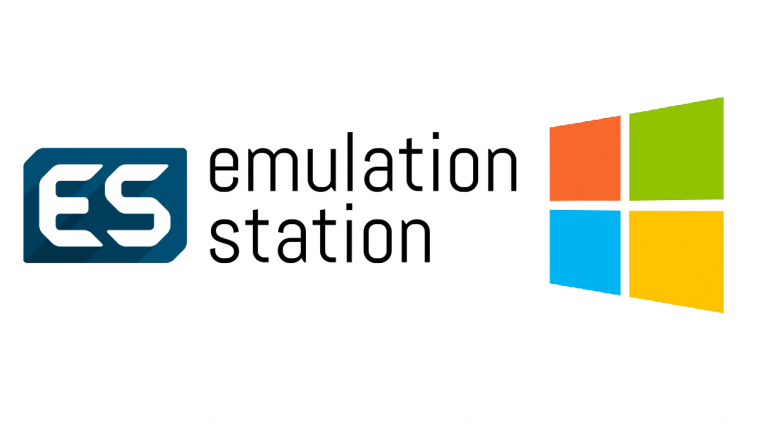

A maioria dos projetos nos quais trabalhei, em todas as empresas, foram projetos corporativos e por isso eu não poderia divulgá-los aqui. Foram realizados nas mais diversas áreas, entre elas: Recursos Humanos, Controle de Estoque e Vendas Indiretas, Gestão de incidentes de TI, Gestão de Contratos, etc.

## Teleresponde

Teleresponde é uma pequena empresa da minha cidade natal, Piracicaba, que agrega informação de parceiros comerciais da cidade e região, com alto grau de confiabilidade. Provendo informações como números de contato e endereço a centenas de usuários. Com versões para Android e iOS, o aplicativo usa tecnologia Cordova e demais tecnologias Web como HTML, CSS e Javascript para buscar informação em uma API Rest e exibir resultados, utilizando também a API do Google Maps.

[Android](https://play.google.com/store/apps/details?id=com.n3up.teleresponde&hl=pt-BR)
[iOS](https://itunes.apple.com/us/app/teleresponde/id1199838723?mt=8)

## Chikaline

Chikalina é o nome do empreendimento de venda de roupas da minha esposa. Ela comercializa roupas as levando até as casas das suas clientes. O negócio em si existe há mais de 15 anos, tendo sido criado pela sua mãe que a acompanha até hoje. O site foi desenvolvido do zero por mim, sem o uso de templates e conta com o uso da Graph API do Facebook para recuperar as últimas fotos que postamos na fanpage.
                    
[Visitar](http://chikalina.com.br/)
                    

## Financial File Manmager

Esta aplicação está sendo desenvolvida para ser open-source (código fonte disponível no [GitHub](https://github.com/PRElias/FinancialFileManager). Ela foi idealizada a partir da necessidade de um cliente real, de conversão de arquivos texto para diversos formatos para importação em aplicações ERP. A maioria dessas aplicações ainda se utiliza de transferências de dados à partir de arquivos e é sempre desafiador realizar essas integrações.

[Protótipo em PDF](https://1drv.ms/b/s!Alnyo-7sjku25Gm65syBWqXdD0V8)

                <!-- End Latest Products -->
            

            <!--// end row -->
            

                <!-- Projeto -->
                

                    

                        

                            <!-- 
                            
                        

                    

                    <h4>document-generator
                        Biblioteca
                    </h4>
                    
Este projeto pessoal surgiu de uma ideia sobre geração e manutenção de documentos funcionais e
                        técnicos
                        de projetos. Ele trabalha com a conversão de arquivos markdown para HTML e você pode obter mais
                        informações
                        no arquivo README do projeto no GitHub, ou no post que fiz sobre o mesmo no meu blog,
                        disponível
                        <a
                            href="http://blog.paulorobertoelias.com.br/index.php/2018/06/27/projeto-document-generator/">aqui</a>
                    

                    

                        <a class="link" target="_blank" href="https://github.com/PRElias/document-generator">Repositório
                            no GitHub</a>
                    

                

                <!-- Fim Projeto -->
                <!-- Projeto -->
                

                    

                        

                            
                        

                    

                    <h5>Simple Business Manager
                        Web Application
                    </h5>
                    
O sistema foi desenvolvido para controlar operações financeiras e no momento não está acessível
                        pois
                        começamos a implantar o uso e apresenta dados reais, mas logo pretendo disponibilizar o seu
                        código-fonte
                        no GitHub, assim como uma versão sem autenticação para demonstração.
                    

                    

                        <a class="link" target="_blank" href="http://sistema.chikalina.com.br">Visitar</a>
                    

                    

                        <a class="link" target="_blank"
                            href="https://github.com/PRElias/SimpleBusinessManager">Repositório
                            no GitHub</a>
                    

                

                <!-- Fim Projeto -->
                <!-- Projeto -->
                

                    

                        

                            
                        

                    

                    <h4>MyCollections
                        Web Application + PWA
                    </h4>
                    
Sistema para controle de coleções de jogos e futuramente livros e filmes. Contruído em dotnet
                        Core, possui código aberto disponível no GitHub e também é disponibilizado no link abaixo.
                        Trata-se de um projeto pessoal para uso próprio e estudo, com contantes evoluções e correções.
                        Saiba mais clicando <a
                            href="http://blog.paulorobertoelias.com.br/index.php/2018/10/17/mycollections-projeto-pessoal-open-source-de-controle-de-colecoes/">aqui</a>
                    

                    

                        <a class="link" target="_blank" href="http://mycollections.paulorobertoelias.com.br">Visitar</a>
                    

                    

                        <a class="link" target="_blank" href="https://github.com/PRElias/MyCollections">Repositório
                            no GitHub</a>
                    

                

                <!-- Fim projeto -->
            

            

                <!-- Projeto -->
                

                    

                        

                            <!-- 
                            
                        

                    

                    <h4>Instalador EmulationStation para Windows
                        Powershell script
                    </h4>
                    
O projeto foi idealizado e desenvolvido por um australiano chamado <a
                            href="https://github.com/Francommit">Chris Franco</a> e que fazia exatamente o que eu
                        procurava. Inclui algumas novas funcionalidades, como integração com o OneDrive e novos
                        emuladores, além da automatização do processo de scraping e passamos a trabalhar juntos no
                        projeto, o que foi muito gratificante.
                    

                    
<a class="link" target="_blank" href="https://prelias.github.io/win10_emulation_station/">Landing
                            Page</a>

                

                <!-- Fim Projeto -->
            

